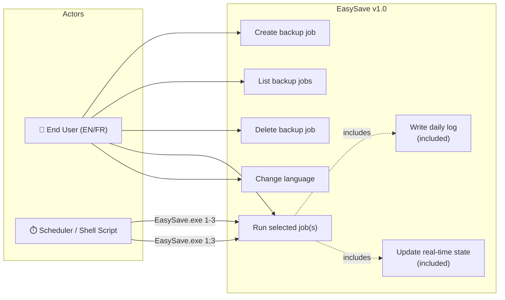

# EasySave v1.0 — Use Case Diagram

## Notes

- **Max 5 jobs** can be defined at any time.
- The **scheduler/shell** uses command-line selectors to run jobs non-interactively.
- Every file operation during a run triggers both a **log write** (EasyLog.dll) and a **state update** (state.json).
- Language selection affects only the console UI; log and state files are always in English.
