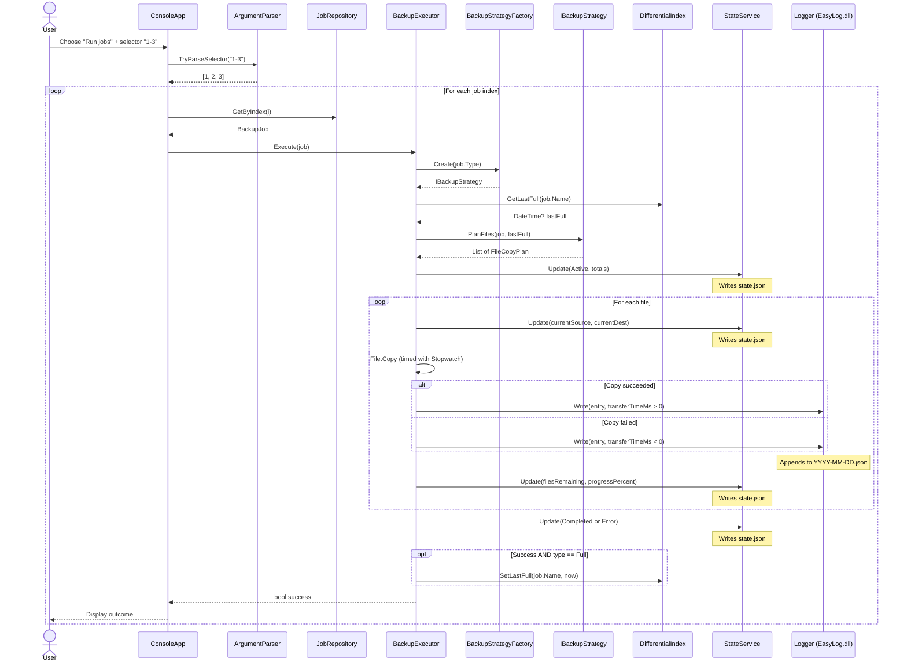

# EasySave v1.0 — Sequence Diagram: Execute Backup Job

## Key observations

- **State.json is updated three times per file**: before copy (current paths), after copy (progress), and on completion (final status). This provides true real-time monitoring.
- **Log entries are written immediately** after each file copy, not batched at the end.
- **Negative `transferTimeMs`** signals an error to any reader of the log file.
- The **DifferentialIndex** is only updated when a Full backup completes successfully.
