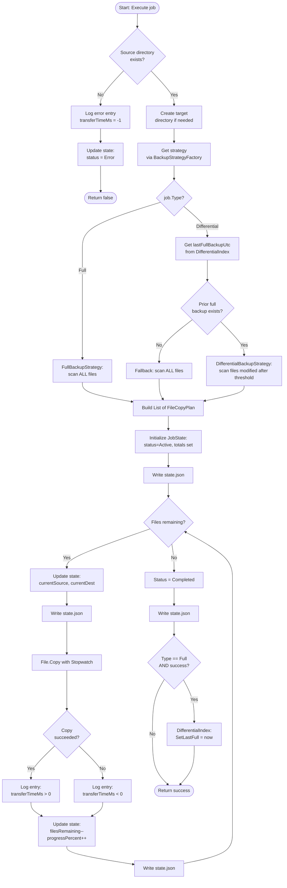

# EasySave v1.0 — Activity Diagram: Backup Execution Flow

```mermaid
flowchart TD
    Start([Start: Execute job]) --> CheckSource{Source directory\nexists?}

    CheckSource -->|No| LogError[Log error entry\ntransferTimeMs = -1]
    LogError --> SetError[Update state:\nstatus = Error]
    SetError --> ReturnFail([Return false])

    CheckSource -->|Yes| CreateTarget[Create target\ndirectory if needed]
    CreateTarget --> GetStrategy[Get strategy\nvia BackupStrategyFactory]
    GetStrategy --> CheckType{job.Type?}

    CheckType -->|Full| FullScan[FullBackupStrategy:\nscan ALL files]
    CheckType -->|Differential| GetIndex[Get lastFullBackupUtc\nfrom DifferentialIndex]
    GetIndex --> HasPrior{Prior full\nbackup exists?}
    HasPrior -->|No| FullScan2[Fallback: scan ALL files]
    HasPrior -->|Yes| DiffScan[DifferentialBackupStrategy:\nscan files modified after threshold]

    FullScan --> BuildPlan[Build List of FileCopyPlan]
    FullScan2 --> BuildPlan
    DiffScan --> BuildPlan

    BuildPlan --> InitState[Initialize JobState:\nstatus=Active, totals set]
    InitState --> WriteState1[Write state.json]

    WriteState1 --> HasFiles{Files remaining?}

    HasFiles -->|No| MarkDone[Status = Completed]
    HasFiles -->|Yes| UpdateCurrent[Update state:\ncurrentSource, currentDest]
    UpdateCurrent --> WriteState2[Write state.json]
    WriteState2 --> CopyFile[File.Copy with Stopwatch]

    CopyFile --> CopyOk{Copy\nsucceeded?}
    CopyOk -->|Yes| LogOk[Log entry:\ntransferTimeMs > 0]
    CopyOk -->|No| LogFail[Log entry:\ntransferTimeMs < 0]

    LogOk --> UpdateProgress[Update state:\nfilesRemaining--\nprogressPercent++]
    LogFail --> UpdateProgress

    UpdateProgress --> WriteState3[Write state.json]
    WriteState3 --> HasFiles

    MarkDone --> WriteStateFinal[Write state.json]
    WriteStateFinal --> WasFull{Type == Full\nAND success?}
    WasFull -->|Yes| SaveIndex[DifferentialIndex:\nSetLastFull = now]
    WasFull -->|No| ReturnResult
    SaveIndex --> ReturnResult([Return success])
```
